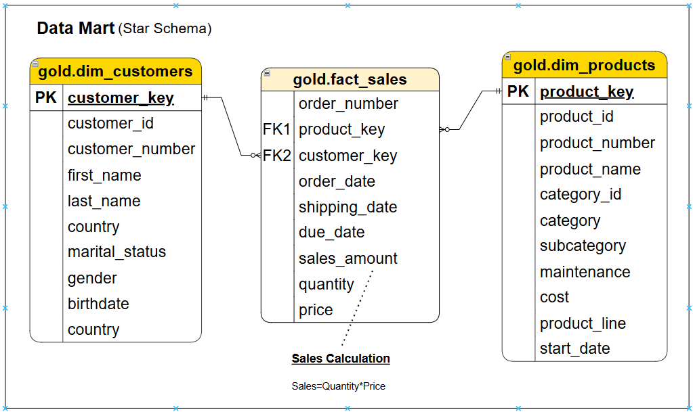

# 🏗 SQL Data Warehouse

Welcome to the **SQL Data Warehouse** repository! 🚀  

This project demonstrates the design and implementation of a structured data warehouse that transforms raw operational data into reliable, analytics-ready datasets for reporting and decision-making.

Built as a portfolio and learning project, it reflects real-world data engineering practices — from data ingestion and transformation to dimensional modeling and analytical data preparation.

The core goal is simple:  
**convert raw data into structured information that supports meaningful business insights.**

---

## 📖 Project Overview

Organizations generate large volumes of data across multiple operational systems.  
However, raw data alone cannot support consistent reporting or reliable analysis.

This project implements a layered data warehouse that:

✔ ingests raw data from source systems  
✔ cleans and standardizes datasets  
✔ integrates data into a unified structure  
✔ models data for analytical queries  
✔ enables scalable and reliable reporting  

The architecture progressively improves data quality from ingestion to analytics.

---

## 🏗 Data Warehouse Architecture

The warehouse follows a layered architecture inspired by the Medallion approach.

Each layer plays a specific role in preparing data for analysis.

| Layer | Role | Description |
|---|---|---|
| **Bronze** | Raw Data Storage | Stores source data exactly as received |
| **Silver** | Data Preparation | Cleans, standardizes, and transforms data |
| **Gold** | Analytics Layer | Business-ready data structured for reporting |

### Architecture Diagram


---

## 🔄 Data Processing Pipeline (ETL)

Data moves through a structured ETL workflow:

1. **Extract** → ingest data from source systems  
2. **Transform** → cleanse, normalize, and standardize  
3. **Load** → store processed data into warehouse layers  

This ensures consistency, accuracy, and analytical usability.

---

## 📊 Analytical Data Model

The Gold layer is modeled using a **star schema**, a standard structure for analytical systems.

This model separates descriptive attributes from measurable business events, improving query performance and analytical clarity.

### Core Tables

| Table | Type | Purpose |
|---|---|---|
| dim_customers | Dimension | Customer demographic and geographic attributes |
| dim_products | Dimension | Product classification and characteristics |
| fact_sales | Fact | Transactional sales records |

### Data Model Diagram


---

## 🔗 Data Integration

Data from multiple operational sources is unified into a single analytical structure.

Integration includes:

- Standardizing formats  
- Resolving inconsistencies  
- Creating unified identifiers  
- Preparing data for dimensional modeling  

This produces a consistent and reliable analytical foundation.

---

## 📚 Documentation

Detailed technical documentation is available in the `docs` directory.

| Document | Purpose |
|---|---|
| docs/data_catalog.md | Table and column definitions |
| docs/naming_conventions.md | Naming standards for database objects |

---

## 🛠 Technology Stack

- Microsoft SQL Server  
- T-SQL  
- Data Warehouse Architecture  
- ETL Processing  
- Dimensional Modeling (Star Schema)

---

## 📂 Repository Structure

```text
sql-data-warehouse/
│
├── datasets/                           # Raw datasets used for the project (ERP and CRM data)
│
├── docs/                               # Project documentation and architecture diagrams
│   ├── high_level_architecture.png     # High-level data warehouse architecture
│   ├── data_flow_diagram.png           # ETL data flow diagram
│   ├── integration_model.png           # Data integration model
│   ├── data_mart.png                   # Star schema / data mart diagram
│   ├── gold_layer_data_catalog.md      # Gold layer data catalog
│   └── naming_conventions.md           # Naming standards for database objects
│
├── scripts/                            # SQL scripts for ETL and transformations
│   ├── bronze/                         # Raw data ingestion scripts
│   ├── silver/                         # Data cleaning and transformation scripts
│   └── gold/                           # Analytical data modeling scripts
│
├── tests/                              # Data validation and testing scripts
│
├── LICENSE                             # Project license (MIT)
├── .gitignore                          # Files ignored by Git
└── README.md                           # Project overview and documentation
```
---

## 📈 Analytical Capabilities

The warehouse supports analysis such as:

- Customer behavior analysis  
- Product performance tracking  
- Sales trend monitoring  
- Revenue reporting  
- Time-based performance insights  

---

## 🎯 Learning Outcomes

Through this project, I gained practical experience in:

- Designing layered data warehouse architecture  
- Building ETL data pipelines  
- Integrating multiple data sources  
- Implementing dimensional modeling  
- Structuring analytics-ready datasets  

Most importantly, this project helped me understand how structured data systems enable reliable business intelligence.

---

## 🙌 Acknowledgment

This project was developed as part of my learning journey in data engineering.

The architecture, workflow, and overall project structure were inspired by the SQL Data Warehouse project by **Data With Baraa**.  
While using the reference for guidance, I implemented the warehouse, ETL logic, and documentation myself, making modifications where needed to deepen my understanding.

Reference repository:  
https://github.com/DataWithBaraa/sql-data-warehouse-project

---

## 👩‍💻 Author

Reddyvari Poojitha 
GitHub: https://github.com/Pooji985

---

## 🛡 License

This project is licensed under the MIT License.

This implementation was developed as a learning and portfolio project inspired by the SQL Data Warehouse project by Data With Baraa.  
The original project is also licensed under the MIT License.
